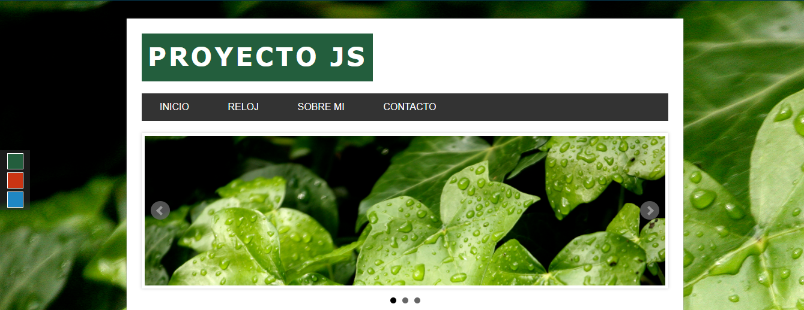

# Refactored Adventure

## ¿Qué es esto?
Esto es un sitio web que contiene mi información como desarrollador además de mis datos de contacto.

## ¿Cómo accedo al sitio?
El sitio está alojado en GitHub Pages, se puede acceder desde este link:
- [ocikotorzido.github.io/refactored-adventure/index.html](https://ocikotorzido.github.io/refactored-adventure/index.html)

## ¿Qué tecnologías usa?
- HTML5
- JS
- CSS
- jQuery

## Agradecimientos

Francisco Marfull
https://github.com/Marfullsen

